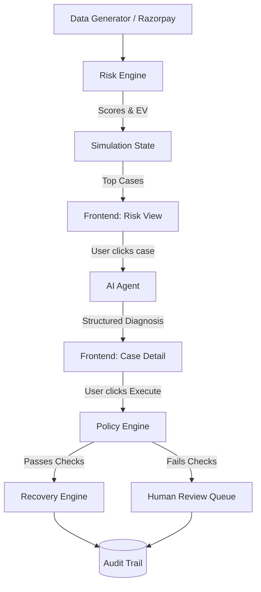

# ReviveAI Architecture

ReviveAI's architecture is designed to enforce a strict boundary between AI reasoning (which is probabilistic) and financial action execution (which must be deterministic).

## System Flow

## Component Breakdown

### 1. Data Layer (`generator.py`)
- Simulates realistic payment failures, abandonment, and overdue invoices.
- Applies ground truth labels (recoverable vs. non-recoverable) for downstream ML evaluation.
- Splits data 70/30 (Train/Eval) completely avoiding data leakage.

### 2. Risk Engine (`risk_engine.py`)
- **Type:** Deterministic Feature Scorer
- **Role:** Extracts features from a payment record and calculates `recovery_probability`, `risk_score`, and `expected_recovery_value_inr`.
- **Why not LLM?** We need to score 100,000 records in seconds. LLMs are too slow and expensive for batch scoring.

### 3. AI Agent (`ai_agent.py`)
- **Type:** LLM (Gemini 2.0 Flash)
- **Role:** Analyzes a single high-priority case. It returns a structured `DiagnosisResult` explaining *why* the failure occurred based on the Risk Engine's feature extraction, and recommends a specific strategy.
- **Safety boundary:** The LLM's output is purely advisory. It cannot directly trigger a payment API.

### 4. Policy Engine (`policy_engine.py`)
- **Type:** Deterministic Rules Engine
- **Role:** The safety gate. Before *any* action is executed, it runs 7 checks:
  1. Retry limit (never exceed 3)
  2. Amount ceiling (escalate anything > ₹50,000)
  3. Consecutive failures (stop after 2)
  4. Customer opt-out (respect communication preferences)
  5. Cooldown (don't spam reminders or retries)
  6. Authorization (is this action allowed to be automated?)
  7. Fraud flags (stop if customer is suspicious)

### 5. Recovery Engine (`recovery_engine.py`)
- **Type:** Workflow Executor
- **Role:** Executes the approved strategy (e.g., Retry, Route Switch, Reminder). Records the outcome.

### 6. Audit Service (`audit_service.py`)
- **Type:** Append-only Ledger
- **Role:** Every risk detected, AI diagnosis, policy check, and executed action is logged immutably.
